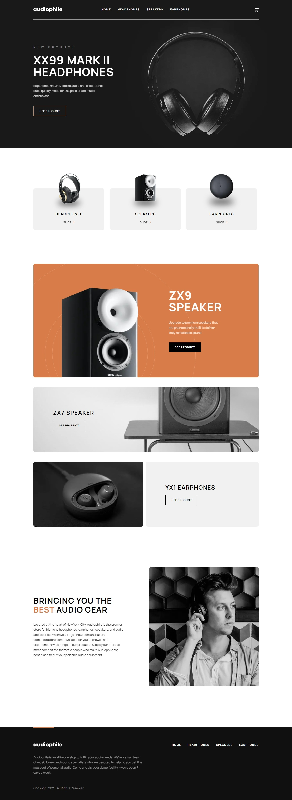

<!-- -   Deploy [click here](https://audiophile-e-commerce-website-adrianoescarabote.vercel.app/) -->

# music e-commerce website

## Table of contents

-   [Overview](#overview)
    -   [The challenge](#the-challenge)
-   [My process](#my-process)
    -   [Screenshot](#screenshot)
    -   [Built with](#built-with)
-   [Author](#author)

## Overview

### The challenge

Users should be able to:

-   View the optimal layout for the app depending on their device's screen size
-   See hover states for all interactive elements on the page
-   Add/Remove products from the cart
-   Edit product quantities in the cart
-   Fill in all fields in the checkout
-   Receive form validations if fields are missed or incorrect during checkout
-   See correct checkout totals depending on the products in the cart
    -   Shipping always adds $50 to the order
    -   VAT is calculated as 20% of the product total, excluding shipping
-   See an order confirmation modal after checking out with an order summary
-   **Bonus**: Keep track of what's in the cart, even after refreshing the browser

### Screenshot

## My process

### Built with

-   Semantic HTML5 markup
-   CSS custom properties
-   Flexbox
-   CSS Grid
-   Axios
-   React Loading Skeleton
-   Redux
-   Typescript
-   [Next.js](https://nextjs.org/) - React framework
-   [Styled Components](https://styled-components.com/) - For styles

### Links

- Live Site URL:(https://music-product-e-commerce.vercel.app/)

## Author

-   Linkedin - [Farhang Alizadeh](https://www.linkedin.com/in/farhang-alizadeh-3bb232235/)
